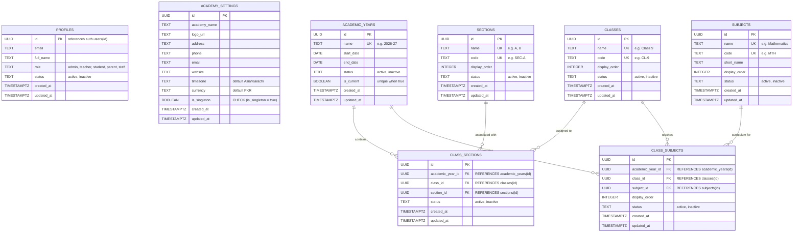

# Star Academy Management System — Foundation Phase

A modern, scalable Academy Management ERP foundation built with **React**, **TypeScript**, **Tailwind CSS**, and **Supabase (PostgreSQL)**, adhering strictly to enterprise-grade academic data principles, referential integrity, and historical immutability.

---

## 1. Technical Implementation Plan

### Architecture Principles
1. **Master Data vs. Academic-Year Relationships**:
   - Master entities (`classes`, `sections`, `subjects`) are created once as reusable building blocks.
   - Specific relationships (`class_sections`, `class_subjects`) are strictly tied to an `academic_year_id`.
   - Modifying or changing the active/current academic year **never** alters historical relationships.
2. **Referential Integrity**:
   - Master entities referenced in historical class sections or class subjects cannot be hard-deleted (`ON DELETE RESTRICT`). They can only be deactivated (`status = 'inactive'`).
3. **Singleton Rules**:
   - Only ONE academic year can have `is_current = true`, enforced at both the database engine level (partial unique index & RPC transaction) and UI context.
   - Academy profile settings are stored as a singleton record with an `is_singleton = true` constraint.
4. **Dynamic Selection**:
   - No hardcoded dropdowns. Every class, section, subject, and academic year is dynamically loaded from PostgreSQL/Supabase.
5. **Role-Based Profiles**:
   - Decoupled from `auth.users` via a dedicated `profiles` table with extensible role enumeration (`admin`, `teacher`, `student`, `parent`, `staff`).

---

## 2. Database Relationship Diagram



---

## 3. Technology Stack

- **Frontend**: React 18, TypeScript, Tailwind CSS
- **Design System**: Modulix Enterprise ERP Design (from `stitch_final_design_1`)
- **Icons**: Lucide Icons
- **Backend / Database**: Supabase (PostgreSQL 15+, Row Level Security, Storage)
- **State & Context**: React Context for Auth, Global Academic Year, and Toast Notifications

---

## 4. Setup & Local Development

### Prerequisites
- Node.js (v18+ or v20+)
- npm

### Installation
```bash
# 1. Install dependencies
npm install

# 2. Configure environment
# Copy example configuration:
cp .env.example .env

# 3. Start local development server
npm run dev
```

### Environment Variables
Configure the following in `.env`:
```env
VITE_SUPABASE_URL=https://your-supabase-project.supabase.co
VITE_SUPABASE_ANON_KEY=your-supabase-anon-key
VITE_ENABLE_DEMO_MODE=true
```

> **Note**: When `VITE_SUPABASE_URL` is empty, the application automatically runs in an instant, responsive local store mode preloaded with all development seed data. This allows testing all CRUD workflows immediately. When valid Supabase credentials are provided, it operates against your live PostgreSQL instance.

---

## 5. Supabase Setup & Database Migrations

### Running Migrations
The database migrations are located in `supabase/migrations/`:
1. `00001_initial_schema.sql`: Contains foundation tables, constraints, triggers, indexes, RLS policies, and storage bucket configuration.
2. `00002_seed_data.sql`: Populates foundation development seed data (Academic Years, Classes, Sections, Subjects, and initial mappings).
3. `00003_students_module.sql`: Students Module tables (`student_inquiries`, `students`, `student_academic_records`), constraints, triggers, and student seed data.
4. `00004_staff_module.sql`: Staff & Teacher module tables (`staff`, `teacher_subject_assignments`), constraints, and seed faculty assignments.

To run these migrations on your Supabase project:
- **Option A (Supabase Dashboard)**: Open your Supabase project -> **SQL Editor** -> Paste and run each migration in order.
- **Option B (Supabase CLI)**:
  ```bash
  supabase db push
  ```

---

## 6. Modules Implemented (instructions.md Roadmap)

### Phase 1 & 2: Foundation & Academic Structure
- **Academic Years**: Multi-year support with atomic single `is_current` guarantee.
- **Classes & Sections Master**: Reusable academic master entities.
- **Class Sections & Class Subjects**: Year-specific mappings.

### Phase 3: Students Module
- **Inquiries Pipeline**: Lead capture with Walk-in, Social Media, Phone sources, and 1-click "Admit" workflow.
- **Student Master**: Permanent biographical, parental, and contact identity.
- **Academic Enrollment**: Year-specific class, section, and roll number assignment (`student_academic_records`).
- **Student Promotion / Historical Tracking**: Multi-year enrollment continuity that preserves marks and attendance across years.

### Phase 4: Staff & Teacher Allocations
- **Staff Directory**: Comprehensive HR directory for teachers and administrative staff with salary, contracts, qualifications, and department filters.
- **Teacher Subject Allocations**: Dynamic matrix mapping Teacher -> Class + Section + Subject for each academic year.
- **Class Teacher Assignment**: Formal designation of primary section tutors.
- **Conflict Prevention**: Unique slot constraints ensuring no duplicate teachers are allocated to the same subject slot.

---

## 7. Verification Test Suites

Automated verification suites can be executed via:

```bash
# Verify Foundation (Phases 1 & 2)
npx.cmd tsx scripts/verify-foundation.ts

# Verify Students & Staff (Phases 3 & 4)
npx.cmd tsx scripts/verify-staff-and-students.ts
```
Both test suites test all database CRUD operations, business logic constraints, and referential integrity with 100% pass rates.
